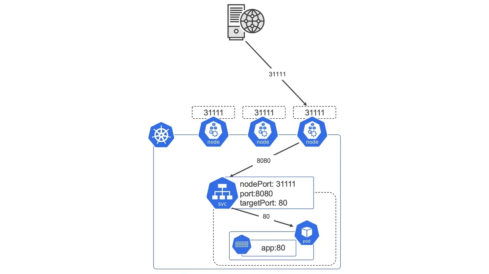

# Getting Started

1. Install [docker](https://docs.docker.com/desktop/windows/wsl/)
    - for docker daemon permission issue, run `sudo chmod 666 /var/run/docker.sock` and `sudo setfacl --modify user::rw /var/run/docker.sock`

1. Install [minikube](https://minikube.sigs.k8s.io/docs/start/) 
    - `brew install minikube`.

1. Setup minikube
    - `minikube start --cpus 3 --memory 8192`
        - additional flags `-docker-env HTTP_PROXY=http://10.0.2.2:35033 --docker-env HTTPS_PROXY=http://10.0.2.2:35033 --driver docker --ports=127.0.0.1:9090:9090`
        - if failed in Ubuntu, re-install [docker engine](https://docs.docker.com/engine/install/ubuntu/) natively. 
        
1. tie docker alias to docker in minikube
    - ubuntu `eval $(minikube docker-env)`
    - windows bash `eval $(minikube -p minikube docker-env)`

1. Build docker image & create container
    - `docker build -t go-get-host-details:0.1.0 ./;` 

## with Kubernetes

1. Apply kubernetes
    - `kubectl apply -f kubernetes/`

1. Test service (in new terminal so that it doesn't conflict with minikube docker alias)
    - `docker exec -it minikube /bin/bash`
    - `curl localhost:30300/host`
        - try calling a few times. Hostname and IP will change among 3 pods defined in kubernetes deployment

1. Undeploy
    - `kubectl delete -f kubernetes/`

## with Helm

1. Install helm
    - `brew install helm`

1. Install service
    - `helm install get-host-details get-host-details/`

1. Uninstall service
    - `helm uninstall get-host-details`

# Extra

- Build Helm
    - `helm create get-host-details`
    - make edits for deployment and service yaml in helm templates 
    - `helm template get-host-details/`

- Build go exe with `CGO_ENABLED=0` for statically linked binaries to bypass `standard_init_linux.go:228: exec user process caused: no such file or directory`
    - `CGO_ENABLED=0 GOOS=linux go build -a -installsuffix cgo -o main`

- Useful kubernetes commands:
    - `kubectl get po,svc`
    - `kubectl delete deploy --all`

- Useful docker commands:
    - `docker run -d -p 9090:9090 --name get-host-details-0.1.0 go-get-host-details:0.1.0`
    - `docker run --rm -it --entrypoint=/bin/bash go-get-host-details:0.1.0`

- Useful commands for minikube
    - `minikube delete --all --purge`
    - `minikube profile list`
    - `minikube delete --profile minikube` to reset minikube (for larger cpu, ram)

- kubernetes port map
    